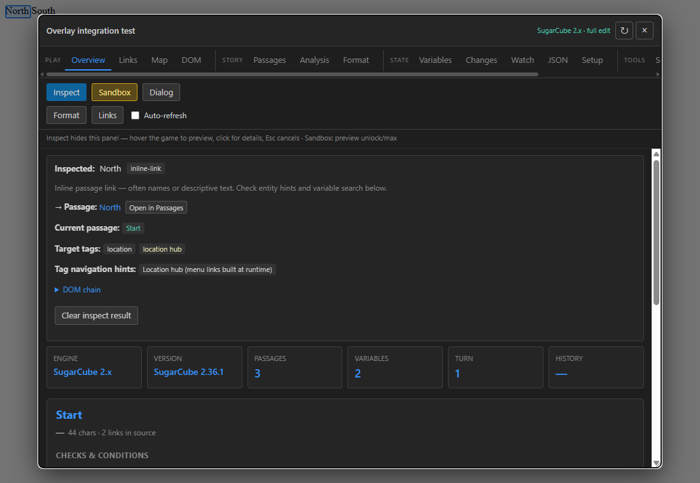
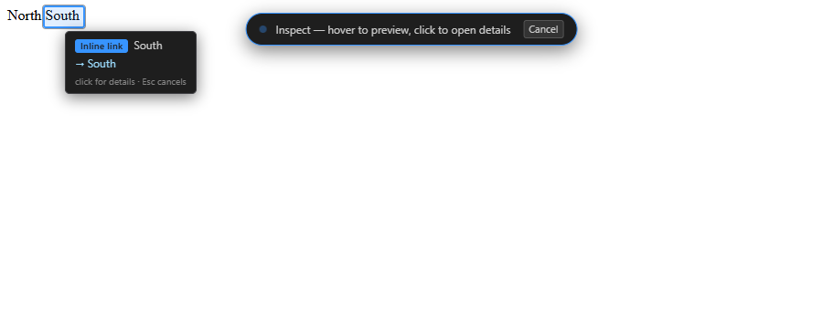

<div align="center">


# Twine Peeks

**Peek inside any Twine game — inspect, visualize, and edit stories while they run.**

[](LICENSE)
[](extension/manifest.json)
[](#installation)
[](#installation)
[](#installation)
[](CHANGELOG.md)

*SugarCube-first, with solid support for Chapbook, Snowman, Harlowe, and universal Twine 2 storydata analysis.*

</div>

---

Twine Peeks is a browser extension **developer toolkit** for [Twine](https://twinery.org/) story games. Open any Twine HTML game — local file or hosted — click the floating button, and get a full inspection panel: live variables, passage source, story maps, link analysis, save decoding, change tracking, and a point-and-click element inspector. No build step, no game modifications, no server.

It's built for:

- 🛠 **Twine authors** — debug your own games: watch variables mutate, verify link graphs, catch broken links and orphan passages, rewind history.
- 🔍 **Curious players & tinkerers** — understand how a game works under the hood, find where that stat lives, learn how other developers structure their stories.
- 📚 **Learners** — study real-world SugarCube macro systems, widget patterns, and state design in games you admire.

<div align="center">

</div>

## ✨ Highlights

### Point-and-click Inspect mode

Click **Inspect** and the panel gets out of your way — the whole game is visible with a crosshair cursor. Hover anything to see what it is *before* you click: link type, target passage (with a warning if the passage doesn't exist), `data-setter` code that runs in place, and variables referenced in the text. Click, and the panel returns with the full breakdown — target passage tags, setter analysis, entity/character data hints, and matching variables. Game navigation is fully suppressed while inspecting, so you can't accidentally advance the story.

<div align="center">

</div>

### Eighteen specialized tabs

| Group | Tab | What it does |
|-------|-----|--------------|
| **Play** | Overview | Engine info, current passage context, choice conditions, recent history with restore, Inspect & Dialog analysis |
| | Links | Every clickable choice on screen — visible, hidden, and in-place actions |
| | Map | Interactive story graph with live DOM edges, neighborhood view, and tag coloring |
| | DOM | All interactive elements with highlight-on-page |
| **Story** | Passages | Browse, search, and **edit** passage source; Twee export |
| | Analysis | Broken links, orphans, dead ends, unreachable passages — with runtime-navigation awareness |
| | Format | Detected macros, widgets, and SugarCube extension points |
| **State** | Variables | Full live variable tree — edit, add, delete, **lock** values against game updates; Map/Set support; temp `_vars` |
| | People | Auto-detected NPC/character registries with stat chips |
| | Changes | Variable mutation log with passage context (diff tracking) |
| | Watch | Pin variables and watch them update in real time |
| | JSON | Export / merge the whole variable store |
| | Setup | Browse the static `setup.*` registry |
| **Tools** | Search | Global search across variables and passage source |
| | Media | Image/audio inventory with availability checks |
| | Saves | Save-slot browser, save-bundle decoder, raw localStorage/sessionStorage explorer |
| | Console | Eval in game context with snippet bar |
| | Chat | [CHATSYSTEM](https://github.com/hituro/hituro-makes-macros) conversation inspector (appears when detected) |

Plus a separate **F12 DevTools panel** (SugarCube-focused subset) if you prefer working in the browser's developer tools.

### Sandbox mode

A heuristic unlock/max tool for learning: preview-first scanning of `State.variables` for flags, stats, meters, and currency with pattern matching. Nothing is applied without an explicit confirmation, and it always recommends a test save.

## 📋 Format support

| Format | Variables | Passages | Navigate | Saves | Analysis | Twee export |
|--------|-----------|----------|----------|-------|----------|-------------|
| **SugarCube 2** | Full + temp `_vars` | Full + edit | `Engine.play` | Full | ✅ | ✅ |
| **SugarCube 1** | Full | Full | `play` | Limited | ✅ | ✅ |
| **Chapbook** | Full via `engine.state` | Full + edit | `go()` | — | ✅ | ✅ |
| **Snowman** | Full via `story.state` | Full + edit | `story.show()` | — | ✅ | ✅ |
| **Harlowe** | Read-only (DOM scrape) | Read + storydata | Click `tw-link` | — | ✅ | ✅ |
| **Storydata fallback** | — | Read | — | — | ✅ | ✅ |

Each format gets its own adapter with detection, link parsing, and a capability profile — the UI adapts to what the engine actually allows and tells you when something is unavailable.

Games embedded in same-origin **iframes** (e.g. itch.io-style wrappers) are supported: the toolkit offers to attach to the frame, and Inspect mode translates coordinates automatically.

## 🚀 Installation

> Not yet on the Chrome Web Store / AMO — install from source:

**Chrome / Edge**

1. Download or clone this repository
2. Open `chrome://extensions` (or `edge://extensions`)
3. Enable **Developer mode**
4. Click **Load unpacked** → select the `extension/` folder

**Firefox (temporary, for development)**

1. Open `about:debugging#/runtime/this-firefox`
2. Click **Load Temporary Add-on…** → pick `extension/manifest.json`

Temporary add-ons are removed when Firefox restarts. To build a `.xpi` package instead:

```powershell
powershell -ExecutionPolicy Bypass -File scripts/package-firefox.ps1
```

For a permanent Firefox install the add-on must be [signed on AMO](https://extensionworkshop.com/documentation/publish/sign-an-extension/) (can be unlisted).

> **Local HTML files:** allow file access — Chrome: extension details → *Allow access to file URLs*. Firefox: about:addons → Twine Peeks → *Allow access to file URLs*.

## 🕹 Quick start

1. Open any Twine HTML game
2. A blue floating button appears bottom-right when a story is detected (drag it anywhere)
3. Click it — or the toolbar icon — to open the panel
4. Try **Inspect**, then hover and click something in the game

Everything runs locally in your browser. The extension never sends data anywhere.

## 🏗 Architecture

```
┌─────────────────────────────── Browser tab ────────────────────────────────┐
│                                                                            │
│  Page world                        Content-script world                    │
│  ┌──────────────────────┐          ┌─────────────────────────────────┐     │
│  │ injected/            │          │ content/bootstrap.js            │     │
│  │  adapters.js         │          │   └─ content.js  (ES module)    │     │
│  │  state-utils.js      │◄────────►│       ├─ overlay.js  (panel UI, │     │
│  │  page-api.js         │ postMsg  │       │   closed shadow DOM)    │     │
│  │  (talks to SugarCube │  bridge  │       ├─ inspect-mode.js        │     │
│  │   / Harlowe / etc.)  │          │       ├─ graph-viz.js           │     │
│  └──────────────────────┘          │       └─ bridge.js              │     │
│                                    └─────────────────────────────────┘     │
│                                                                            │
│  panel/  — separate DevTools panel (F12), simpler SugarCube-focused UI     │
└────────────────────────────────────────────────────────────────────────────┘
```

- **Adapters** (`injected/adapters.js`) detect the story format and expose a uniform capability profile. Detection results and storydata parses are cached for speed.
- **The page API** (`injected/page-api.js`) runs in the page world with direct access to `SugarCube.*`, `window.story`, etc., and answers requests over a `postMessage` bridge.
- **The overlay** (`content/overlay.js`) renders in a closed shadow root so game CSS can't touch it — and vice versa. Keyboard events are shielded from the game while the panel is open.
- **Performance:** passage parses and adapter detection are cached; the Map's neighborhood view uses targeted BFS instead of building the full graph; the graph renderer batches edges above ~1200. A 5000-passage story lists passages in ~40 ms and builds the full graph in ~55 ms.

## 🧪 Development & testing

No build step — the extension loads straight from `extension/`.

Browser test harnesses live in `tests/` (a fake SugarCube game plus a stubbed `chrome` API):

```bash
# from the repo root
python -m http.server 8765
# then open:
#   http://localhost:8765/tests/test-injected.html  → window.runTests()
#   http://localhost:8765/tests/test-overlay.html   → full overlay, window.__overlay
#   http://localhost:8765/tests/test-graphviz.html  → graph renderer
```

Quick syntax check (ES modules need the `.mjs` rename trick):

```bash
node --check extension/injected/page-api.js
cp extension/content/overlay.js /tmp/overlay.mjs && node --check /tmp/overlay.mjs
```

Every push runs CI (syntax checks, manifest validation, `web-ext lint`, `.xpi` packaging). Version tags get the `.xpi` attached to the GitHub Release automatically — see [docs/RELEASING.md](docs/RELEASING.md), including how to sign for Firefox via AMO.

### Project structure

```
extension/
├── manifest.json          # MV3, Chrome + Firefox (browser_specific_settings)
├── content/               # content scripts: overlay UI, inspect mode, bridge
├── injected/              # page-world scripts: format adapters, page API
├── panel/                 # F12 DevTools panel (separate, simpler UI)
├── lib/                   # shared helpers (console snippets)
├── popup.html/js          # toolbar popup
└── options.html/js        # DevTools panel options
scripts/                   # Firefox .xpi packaging (local)
tests/                     # browser test harnesses
docs/                      # screenshots + releasing/signing guide
.github/workflows/         # CI: checks, packaging, releases, AMO signing
```

## 🤝 Contributing

Issues and pull requests are welcome! Good first contributions:

- Format adapters for other engines (Ink/Bink exports, custom storydata dialects)
- Detection for popular macro libraries and custom framework patterns
- More test-harness coverage

Please keep the performance invariants (cached passage parse, targeted BFS for neighborhood maps) and run the test harnesses before submitting.

## ⚖️ Responsible use

Twine Peeks is a development and learning tool. Variable editing, save decoding, and Sandbox mode operate on **your own browser's local game state** — the same things you could do in the F12 console, made convenient. Use a test save before editing, and be considerate: don't use it to spoil shared/online experiences or violate a game's terms.

## 🙏 Acknowledgements

Twine Peeks learned from and adapts ideas from earlier open Twine tooling — notably [Twine Dugger](https://github.com/Goctionni/twine-dugger) (MIT) and [TwineHacker](https://github.com/La-Li-Lu-Le-Lo/TwineHacker), and supports games built with [hituro's CHATSYSTEM macros](https://github.com/hituro/hituro-makes-macros). See [ACKNOWLEDGEMENTS.md](ACKNOWLEDGEMENTS.md) for full credits and license notices.

## 📄 License

[MIT](LICENSE) © 2026 Joen Berg ([@joenb33](https://github.com/joenb33))
